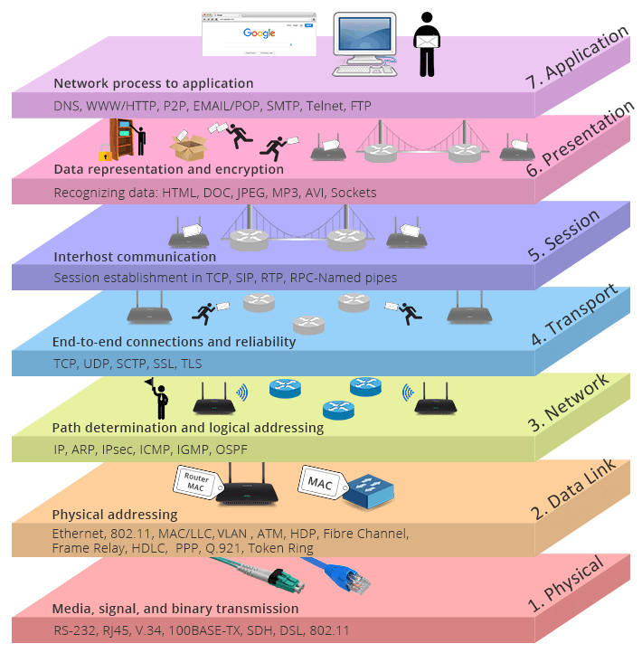
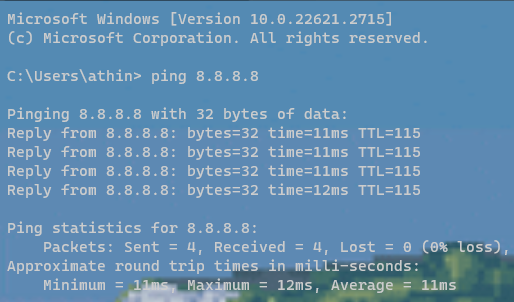
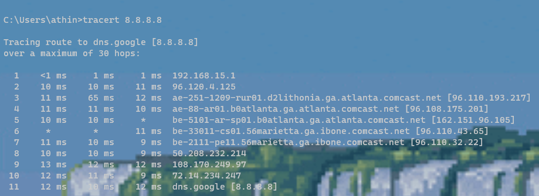
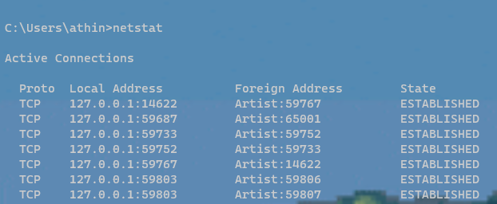

# Table of Contents 

- [OSI & TCP/IP Model](#osi--tcpip-model)
  - [Physical Layer](#physical-layer)
  - [Data Link Layer](#data-link-layer)
  - [Network layer](#network-layer)
  - [Transport Layer](#transport-layer)
  - [Session Layer](#session-layer)
  - [Presentation Layer](#presentation-layer)
  - [Application Layer](#application-layer)
  
# OSI & TCP/IP Model 

The OSI Model is a reference framework that explains the process of transmitting data between computers. It is divided into seven layers that work together. TCP/IP was designed and developed by the Department of Defense (DoD) in the 1960s and is based on standard protocols. It stands for Transmission Control Protocol/Internet Protocol. It contains four layers, unlike the seven layers in the OSI model.

## Physical Layer 

This layer is responsible for the actual physical connection between devices. It contains information in the form of bits. 

### The main functions of this layer include

- **Encoding and signaling**: The method of encoding digital data into electrical, optical, or radio signals for transmission over the physical medium.

- **Physical media**: cables, fiber optics, or wireless channels

- **Data transmission**: It establishes the rules for transmitting raw data bits over the physical medium, including aspects like bit synchronization, line coding, and error detection.

- **Physical topologies**: It defines the physical arrangement or layout of network devices and how they are connected, such as bus, star, ring, or mesh topologies.

- **Transmission modes**: It describes the ways in which data is transmitted between devices, such as simplex (one-way), half-duplex (two-way but not simultaneously), or full-duplex (two-way simultaneously).

### Examples - Physical 

- Ethernet with 1000BASE-T.
- Ethernet with 1000BASE-SX.
- Ethernet at 100BaseT.
- Synchronous Digital Hierarchy/Optical Synchronisation.
- Physical-layer variations in 802.11.
- Bluetooth.
- Networking for controllers.
- U.S. Serial Bus

### Commands - Physical

- **ping**: This command is used to test the connectivity between two devices by sending and receiving ICMP echo packets.

- **show interface**: This command displays information about the physical interfaces on a network device, such as their status, speed, and duplex mode.

## Data Link Layer 

The data link layer is the second layer of the OSI model, and it is responsible for sending and receiving data frames over a physical link. It provides error detection and correction, addressing, and flow control to ensure that data is transmitted reliably and efficiently. When a packet arrives in a network, it is the responsibility of the DLL to transmit it to the Host using its MAC address. 

It's broken up into sub layers:

- *Logical Link Control (LLC)*: Responsible for ensuring that data can be transmitted reliably and efficiently between different applications and services on a network.

- *Media Access Control (MAC)*: Unique addresses to each device on the network. These addresses are used to identify the source and destination of data frames.

### The main functions of the data link layer

- **Error detection & correction**: Uses techniques to detect and correct errors in data transmission. These techniques include error-detecting codes, such as cyclic redundancy checks (CRCs), and error-correcting codes

- **Addressing**: Encapsulates the source & destination's MAC address in the hearder of each frame.

- **Flow control**: Controls the flow of data between devices to prevent congestion. This is done by using techniques such as stop-and-wait, sliding window, and token bucket algorithms.

### Examples - Data Link

- Synchronous Data Link Protocol (SDLC)
- High-Level Data Link Protocol (HDLC)
- Serial Line Interface Protocol (SLIP)for encoding
- Point to Point Protocol (PPP)
- Link Access Procedure (LAP)
- Link Control Protocol (LCP)
- Network Control Protocol (NCP)

### Commands - Data Link

- **show arp**: This command displays the ARP cache on a network device, which is a table of MAC addresses and their corresponding IP addresses.

- **show spanning-tree**: This command displays information about the Spanning Tree Protocol (STP), which is used to prevent loops in switched networks.

## Network layer 

The network layer is the third layer of the OSI model, and it is responsible for routing data packets across a network. It is like the postal service for data packets, making sure that they are delivered to the correct address. If the packets are too large for delivery, they are fragmented. The source and destination addresses are added to the data packets inside the network layer.

### The main functions of the network layer

- **Adding source and destination IP addresses to packets**: The network layer adds the source and destination IP addresses to packets.

- **Routing packets through the network**: The network layer uses routing tables to determine the best path for each packets to take through the network. Routing tables are databases that contain information about the network topology, such as which routers are connected to which other routers and what the cost is of sending data between each router.

### Commands - Network

- **traceroute**: This command traces the path that a packet takes from a source device to a destination device.

- **show ip route**: This command displays the IP routing table on a network device, which is a table of IP addresses and their corresponding next-hop routers.

## Transport Layer

The transport layer is the fourth layer in the OSI model and is responsible for providing end-to-end communication between applications on different computers.

### The main functions of the transport layer

- **The Process to Process Delivery**: Transport Layer requires a Port number to correctly deliver the segments of data to the correct process amongst the multiple processes running on a particular host. A port number is a 16-bit address used to identify any client-server program uniquely.

- **End-to-End Connection between Hosts**: The transport layer is also responsible for creating the end-to-end Connection between hosts for which it mainly uses TCP and UDP. TCP is a secure, connection-orientated protocol that uses a handshake protocol to establish a robust connection between two end hosts. TCP ensures the reliable delivery of messages and is used in various applications. UDP, on the other hand, is a stateless and unreliable protocol that ensures best-effort delivery.

- **Multiplexing and Demultiplexing**: Multiplexing is the process of combining multiple data streams from different applications or processes into a single data stream for transmission over a network. This is like the kitchen staff consolidating multiple orders into a single ticket. The multiplexing process typically involves adding headers to each data stream to identify its origin and destination. At the receiving end, the reverse process of demultiplexing occurs. The received data stream is split back into its original individual data streams and delivered to the respective applications or processes. This is like the kitchen staff sorting through the order tickets and delivering each dish to the correct customer.

- **Congestion Control**: Congestion is a situation in which too many sources over a network attempt to send data and the router buffers start overflowing due to which loss of packets occurs. Transport layer uses open-loop congestion control to prevent congestion and closed-loop congestion control to remove the congestion in a network once it occurred.

- **Data integrity and Error correction**: The transport layer checks for errors in the messages coming from the application layer by using error detection codes, and computing checksums, it checks whether the received data is not corrupted and uses the ACK and NACK services to inform the sender if the data has arrived or not and checks for the integrity of data.

### Examples - Transport 

- Transmission Control Protocol (TCP)
- User Datagram Protocol (UDP)
- Stream Control Transmission Protocol (SCTP)
- Datagram Congestion Control Protocol (DCCP)
- AppleTalk Transaction Protocol (ATP)
- Fibre Channel Protocol (FCP)
- Reliable Data Protocol (RDP)
- Reliable User Data Protocol (RUDP)
- Structured Steam Transport (SST)
- Sequenced Packet Exchange (SPX)

### Commands - Transport

- **netstat**: This command also displays information about session layer connections that are currently active on a device.

- **show ip nsf**: This command displays information about NetBIOS over TCP (NBT) connections that are currently active on a network device.

## Session Layer

The Session Layer, also known as Layer 5 in the OSI model, is responsible for establishing, managing, synchronizing, and terminating sessions between end-user applications on different machines. Imagine you're having a video call with a friend. The Session Layer acts like the virtual meeting room, managing the connection between your devices and ensuring that the video and audio streams flow seamlessly. 

### The main functions of the Session layer

- **Establishing, managing, and terminating sessions**: The session layer is responsible for establishing connections between applications, managing the ongoing communication, and terminating sessions when communication is complete.

- **Session checkpointing**: The session layer establishes checkpoints in the data stream to allow for recovery in case of interruptions. This is especially important for applications that need to maintain a consistent state, such as databases or online games.

- **Data synchronization**: The session layer ensures that data streams are synchronized between applications, preventing data loss or corruption. It uses techniques like sequencing and error handling to maintain data integrity.

### Examples - Session

- AppleTalk Data Stream Protocol (ADSP)
- Real-time Transport Control Protocol (RTCP)
- Point-to-point Tunneling Protocol (PPTP)
- Password Authentication Protocol (PAP)
- Remote Prcedure Call Protocol (RPCP)

### Commands - Session

- **telnet**: This command is used to connect to a remote device using the Telnet protocol.

- **ssh**: This command is used to connect to a remote device using the SSH protocol, which is a more secure alternative to Telnet.

## Presentation Layer

The Presentation Layer, also known as Layer 6 in the OSI model, acts as the translator and data format manager for network communication. It bridges the gap between the Application Layer, which deals with user-centric data, and the lower-level layers that handle data transmission or in other words converts the data sent by the application layer of the transmitting node into an acceptable and compatible data format based on the applicable network protocol and architecture.

### The main functions of the Presentation layer

**Data Format Conversion**: It translates data from the format used by the Application Layer into a format that is compatible with the network protocols and the receiver's system. This ensures that data can be interpreted correctly and utilized by different applications and devices.

**Data Encryption and Decryption**: It applies encryption algorithms to protect sensitive data during transmission and decryption algorithms to retrieve the original data at the receiving end. This safeguards data confidentiality and prevents unauthorized access or modification.

**Data Compression and Decompression**: It compresses data to reduce its size and improve transmission efficiency, especially for large files or data streams. This conserves bandwidth and reduces transmission time.

**Character Code Conversion**: It converts between different character encoding schemes, such as ASCII, Unicode, or EBCDIC, to ensure that text-based data is displayed correctly across different systems.

### Examples - Presentation

- Apple Filing Protocol (AFP)
- NetWare Core Protocol (NCP)
- Secure Socket Layer (SSL)

## Application Layer 

The Application Layer, also known as Layer 7 in the OSI model, sits at the top of the communication stack and serves as the interface between network applications and the underlying network infrastructure. It provides a range of services and protocols that enable users to interact with network resources and exchange information seamlessly. Imagine you're browsing the web using a web browser. The Application Layer acts as the control center for this interaction, translating your actions into network requests, sending those requests to lower layers, and interpreting the responses received.

### The main functions of the Application layer

- **User Interaction**: The Application Layer provides the means for users to interact with network applications, including web browsers, email clients, file transfer programs, and media streaming applications. It translates user actions into network requests and presents the received data in a way that users can understand.

- **Application-Specific Protocols**: The Application Layer defines and implements protocols specific to different types of applications, such as HTTP for web browsing, FTP for file transfers, and SMTP for email communication. These protocols provide the rules and structures for exchanging data between applications.

- **Network Resource Access**: The Application Layer handles the process of accessing and utilizing network resources, such as servers, databases, and other network devices. It translates user requests into appropriate network protocols and facilitates the exchange of data with these resources.

- **Data Presentation**: The Application Layer formats and presents data in a way that is meaningful to users. It converts data from network formats into human-readable forms, such as text, images, and audio/video streams.

- **Application Services**: The Application Layer provides a variety of application services, such as file sharing, email, instant messaging, and online gaming. These services enable users to collaborate, communicate, and engage in various activities over the network.

### Examples - Application

- Telnet
- DNS
- DHCP
- FTP
- SMTP
- HTTP
- NFS
- SNMP