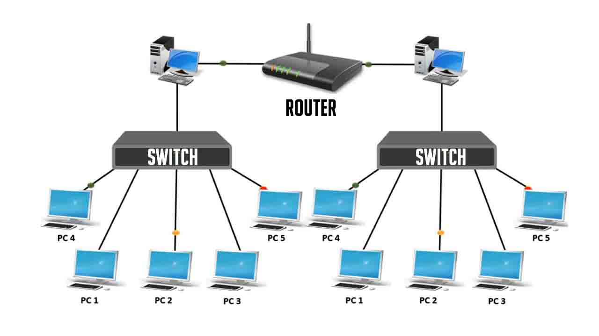

# Table of contents

- [Routing and Switching](#routing-and-switching)
  - [Routers](#routers)
  - [Switches](#switches)
  - [Examples](#examples)
  
# Routing and Switching

Routing and switching are two fundamental processes in computer networking that enable seamless data transmission across networks. While both concepts share the common goal of directing traffic, they differ in their scope and approach.

## Routers

Routers operate at the network layer of the OSI model, acting as the traffic directors of the internet. They connect different networks, including the internet, and make intelligent decisions about the best path to send data packets to their intended destinations. Routers maintain routing tables, which are like road maps for data packets, containing information about network topologies, paths to other networks, and network traffic conditions.

When a data packet arrives at a router, the router examines its destination address and consults its routing table to determine the most efficient path for the packet to reach its destination. This process ensures that data packets navigate through the vast network of interconnected networks efficiently, avoiding congestion and reaching their final destinations with minimal delay.

## Switches

Switches operate at the data link layer of the OSI model, responsible for forwarding data frames within a single network segment. They connect multiple devices within a network, such as computers, printers, and servers, and allow them to communicate with each other. Switches maintain a MAC address table, containing the unique MAC addresses of connected devices. When a data frame arrives at a switch, it examines the destination MAC address and forwards the frame to the appropriate port connected to the destination device. This ensures that data frames reach the intended recipient without being sent unnecessarily through other networks or devices.

## Examples

- Dynamic Host Configuration Protocol (DHCP): DHCP automatically assigns IP addresses and other network configuration settings to devices on a network, eliminating the need for manual configuration.

- Network Address Translation (NAT): NAT translates IP addresses between private and public networks, allowing multiple devices within a private network to share a single public IP address, enhancing security and privacy.

- Routing Protocols: Routing protocols, such as OSPF (Open Shortest Path First) and BGP (Border Gateway Protocol), enable routers to exchange routing information and dynamically update their routing tables, ensuring that data packets always take the most efficient path to their destinations.

- OSPF: OSPF is an interior gateway protocol (IGP) used within an autonomous system (AS) to determine the shortest paths between networks. It utilizes a link-state routing algorithm, where routers share information about their local network topology, allowing them to build a comprehensive understanding of the network and calculate optimal paths.

- BGP: BGP is an exterior gateway protocol (EGP) used to exchange routing information between different ASes. It plays a crucial role in connecting different networks across the internet, enabling data packets to traverse across different providers and reach their intended destinations seamlessly.