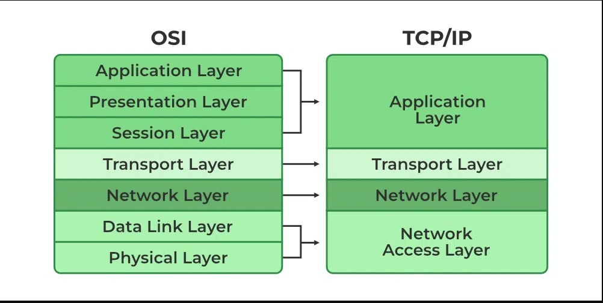

# TCP/IP

TCP/IP stands for Transmission Control Protocol/Internet Protocol. It is a suite of communication protocols that are used to interconnect network devices on the internet. TCP/IP is the foundation of the internet and enables devices to communicate with each other using a common language.

The TCP/IP protocol suite is divided into four layers:

Application layer: This layer provides services to applications, such as file transfer, email, and web browsing.

Transport layer: This layer ensures that data is transmitted reliably between applications. The two main transport layer protocols are TCP and UDP. TCP provides reliable, connection-oriented data transmission, while UDP provides unreliable, connectionless data transmission.

Internet layer: This layer is responsible for routing data packets across the internet. The two main internet layer protocols are IP and ICMP. IP is responsible for addressing and routing data packets, while ICMP is responsible for error messages and network management.

Link layer: This layer is responsible for transmitting data frames over a physical network, such as Ethernet or Wi-Fi. The two main link layer protocols are Ethernet and 802.11.
