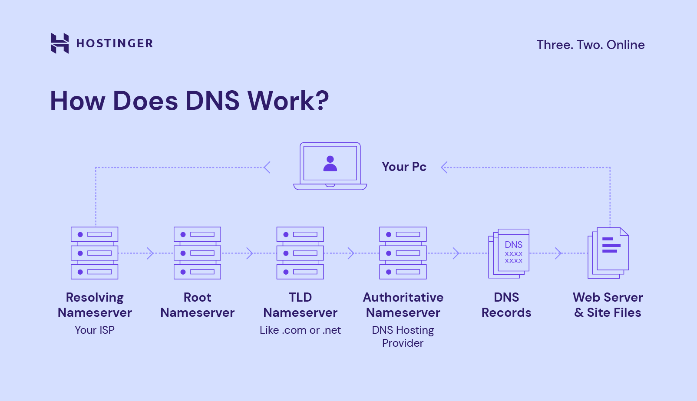
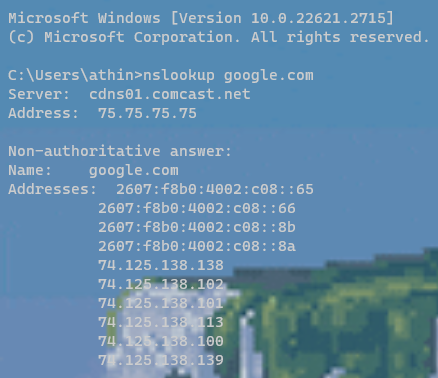
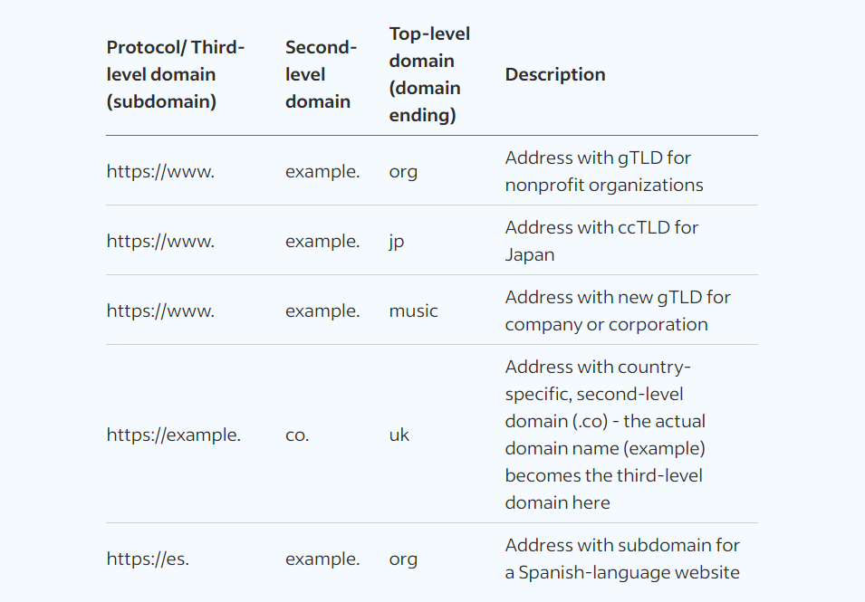

# Table of contents

- [Domain Name Server (DNS)](#domain-name-server-dns)
- [Domain Types](#domain-types)
  - [Root Domain](#root-domain)
  - [Top-Level Domains (TLDs)](#top-level-domains-tlds)
  - [Country-code TLDs (ccTLDs)](#country-code-tlds-cctlds)
  - [Second-Level domains](#second-level-domains)
  - [Third-Level domain](#third-level-domain)
- [Authoritative DNS Server Vs Recursive DNS Resolver](#authoritative-dns-server-vs-recursive-dns-resolver)
  - [Authoritative DNS Server](#authoritative-dns-server)
  - [Recursive DNS Resolver](#recursive-dns-resolver)
- [DNS record types](#dns-record-types)

#  Domain Name Server (DNS)

DNS stands for Domain Name System. It is a hierarchical and distributed naming system for computers, services, or other resources. It translates domain names (www.example.com) to IP addresses (`192.0.2.44`), allowing users to access websites and other online resources by using easy-to-remember names instead of numerical IP addresses. The DNS system works like a phonebook for the internet. When a user types a domain name into a web browser, the browser sends a query to a DNS server. The DNS server then looks up the IP address associated with that domain name and returns it to the browser. The browser then uses the IP address to connect to the website or online resource.

# Domain Types

## Root Domain

The root domain is represented by a period (.).

## Top-Level Domains (TLDs)

Called an extension or domain ending, refers to the suffix and the last part of a web address to the right of the last dot after the primary domain name. 

### Examples

- .com
- .org
- .gov
- .edu
- .net
- .mil

## Country-code TLDs (ccTLDs)

A two-letter domain extension that represents a specific country, autonomous territory, sovereign state or geographic location. 

### Examples 

- .us
- .fr
- .eu
- .au
- .ca

## Second-Level domains

The domain title. For example, the Google in www.google.com is the second level domain.

## Third-Level domain

Also called the subdomain to the second level, indicates the type of server that the domain connects to when accessing website data.

### Examples

- shop.website.com
- blog.website.com
- support.website.com
- app.website.com

# Authoritative DNS Server Vs Recursive DNS Resolver

## Authoritative DNS Server

An authoritative DNS server is a type of DNS server that holds the definitive information about a specific domain name. It is responsible for providing accurate and up-to-date information about the domain name, including its IP addresses and other relevant records. Authoritative DNS servers are typically operated by the domain name registrar or the organization that owns the domain name.

When a DNS resolver sends a query for a domain name, the query is eventually routed to an authoritative DNS server for that domain. The authoritative DNS server then responds to the query with the correct information about the domain name.

Imagine the phone book company that publishes and distributes the phone books for a particular region. They maintain the most accurate and up-to-date information about phone numbers and addresses for their area.

## Recursive DNS Resolver

A recursive DNS resolver is a type of DNS server that is responsible for resolving DNS queries on behalf of other DNS servers or end-users. When a recursive DNS resolver receives a query for a domain name, it first checks its cache to see if it already knows the answer. If it does, it returns the cached information to the client. If it does not, it forwards the query to another DNS server, typically a root server, to find the answer.

The recursive DNS resolver continues to forward the query to other DNS servers until it eventually reaches an authoritative DNS server for the domain name. Once it receives the correct information from the authoritative DNS server, it caches the information and returns it to the client.

Think of a person using a phone book to find a phone number. They first check the phone book to see if they can find the number directly. If they don't, they might ask a friend or family member for the number. If still unsuccessful, they might call the operator for assistance. The operator, like a recursive DNS resolver, would consult various resources to find the correct phone number.

# DNS record types

- **A (Address) Record**: Maps a domain name to an IPv4 address.
- **AAAA (Address) Record**: Maps a domain name to an IPv6 address.
- **CNAME (Canonical Name) Record**: Maps an alias domain name to a canonical domain name.
- **MX (Mail Exchange) Record**: Specifies the mail servers responsible for handling email for the domain.
- **TXT (Text) Record**: Contains human-readable or machine-readable text, often used for verification purposes or providing additional information about a domain.