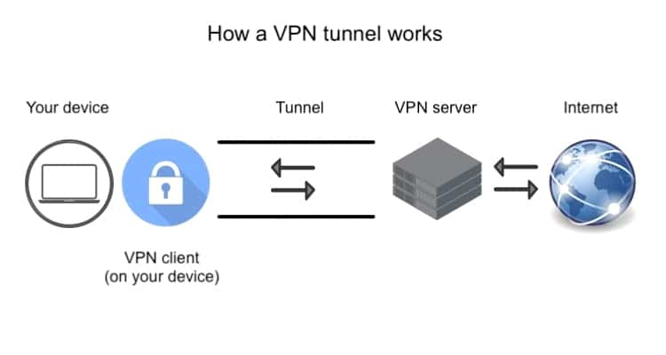

# What is a VPN?

A VPN, or Virtual Private Network, is a service that encrypts your internet connection and protects your online privacy and security. It creates a secure tunnel between your device and a VPN server, making it difficult for anyone to snoop on your data or track your online activity.

# VPN tunneling

VPN tunneling is the process of establishing a secure connection between a user's device and a VPN server. This connection is used to encrypt all of the user's data traffic, making it difficult for third parties to intercept and snoop on the data. In other words, VPN tunneling is the foundation of how VPNs work. Without VPN tunneling, VPNs would not be able to protect users' privacy or security.

# How does VPN tunneling work?

1. The user establishes a connection to a VPN server. This can be done using a VPN client application or by manually configuring the user's device.

2. The VPN server encrypts all of the user's data traffic. This data is then sent through the public internet to the VPN server.

3. The VPN server decrypts the data traffic and forwards it to the intended destination. This could be a website, a streaming service, or any other online resource.

4. The response from the destination is sent back to the VPN server. The VPN server encrypts the response and sends it back to the user.

5. The user's device decrypts the response and displays it to the user.