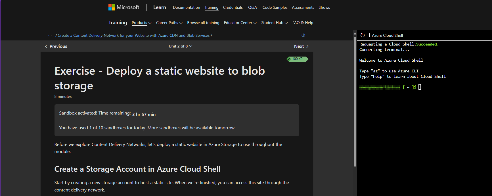
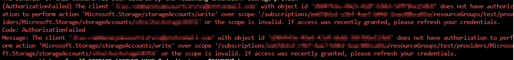
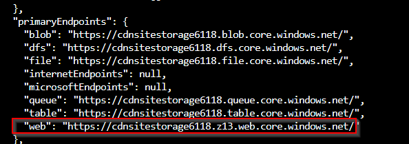
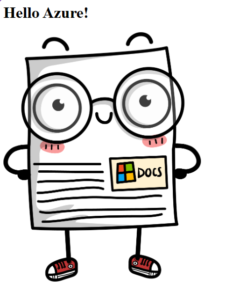
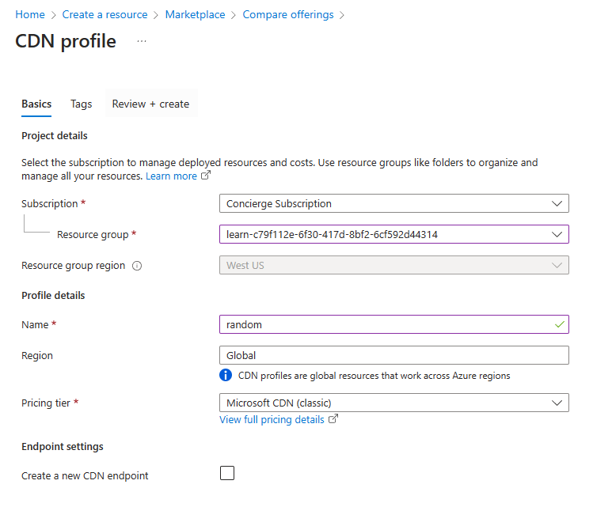
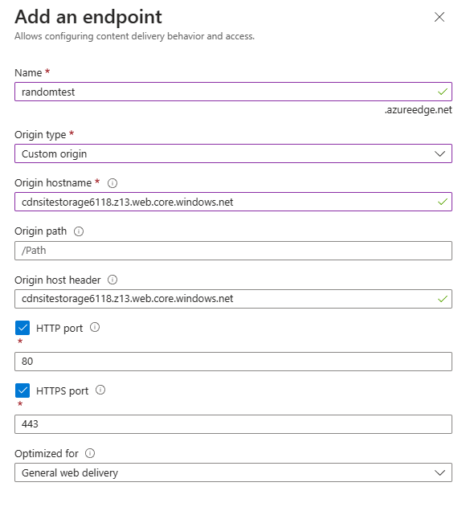
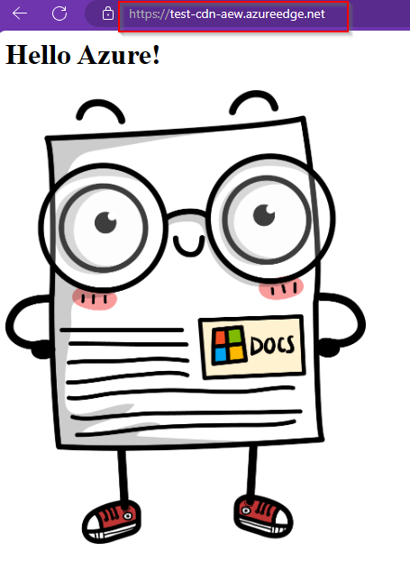
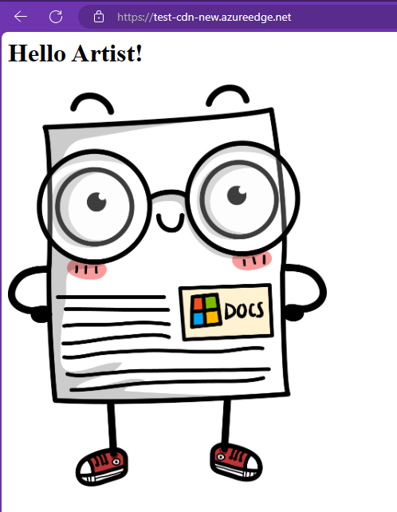

<p align="center">
  
</p>

# *Azure CDN and Blob Services*

This "project" is going to be a simply exercise of creating a Content Delivery Network (CDN) for our static website with Azure CDN and Blob Services.
https://learn.microsoft.com/en-us/training/modules/create-cdn-static-resources-blob-storage/

Now what excatly is a CDN? It's basically a network of servers that hold or cache content to deliver to users from all over the world so they don't experience latency.

How does CDN it work? Let's say I wanted to access a website that was hosted all the way in Afica, the content from that website will be store in a POP or point of presence location that's near me. What if my POP doesn't have the file cached? no worries! the POP location will request the file from the orgin server and cache the file until the TTL expires.

## Deploy a static website to blob storage

The first thing we want to do in this excercise is deploy a static website to blob storage, same thing with creating a S3 bucket and making it static. 

Microsoft always learners to create a sandbox in their Azure environment to implement solutions with no charge, so we're gonna use the sandbox provided. 

<p align="center">
  
</p>

To manage the static website from the CLI we must install storage preview.

```bash
az extension add --name storage-preview
```

Creating variables make running commands shorter and cleaner.

```bash
STORAGE_ACCOUNT_NAME="cdnsitestorage$RANDOM" \
RESOURCE_GROUP=[sandbox resource group name] \
LOCATION=<location>
``` 
> Make sure you get the actually resource group name from the sandbox directory using the ```az group list```.

Afterwards create a storage account to hold the blob.

```bash
az storage account create --name $STORAGE_ACCOUNT_NAME --resource-group $RESOURCE_GROUP --location $LOCATION --sku Standard_LRS --kind StorageV2
```

I bumped into this error and wanted to bring this to attention. 

<p align="center">
  
</p>

Make sure you are using the resource group the sandbox has created for you!! If you used the resource group and get JSON output, at the end of it your gonna see multiple primary endpoint URLs, the one we one is called "web"

<p align="center">
  
</p>

Now to enable static website hosting!

```bash
az storage blob service-properties update --account-name $STORAGE_ACCOUNT_NAME --static-website --404-document 404.html --index-document index.html
```

Microsoft gives us a template we can use from their repo.

```bash
git clone https://github.com/MicrosoftDocs/mslearn-create-cdn-static-resources-blob-storage source
```

Let's change directories and upload the files to the blob storage container.

```bash
az storage blob upload-batch -s . -d \$web --account-name $STORAGE_ACCOUNT_NAME
```

and voila! We have a static website.

<p align="center">
  
</p>

## Create a CDN profile and endpoint

An Azure CDN profile is used to manage and organize multiple endpoints for different content types or delivery needs and an endpoint is a specific configuration for delivering content from a particular origin. For the profile we used the Azure CDN Standard from Microsoft. A classic option.

<p align="center">
  
</p>

Created an endpoint and pointed it to our static website.

<p align="center">
  
</p>
> Doesn't have to be a custom origin, there's an option in the drop down.

Make sure the CDN is configured properly by lauching the endpoint hostname.

<p align="center">
  
</p>

Had a little fun and changed the heading code to see if the endpoint picks up any changes from the blob storage.

<p align="center">
  
</p>
> Had deleted the old endpoint because I was tired and wanted some sleep but wanted to finish this first. Later learned that I can purge the endpoint to display updated content from the storage account. 

That is all for this exercise, was short but a refresher. 