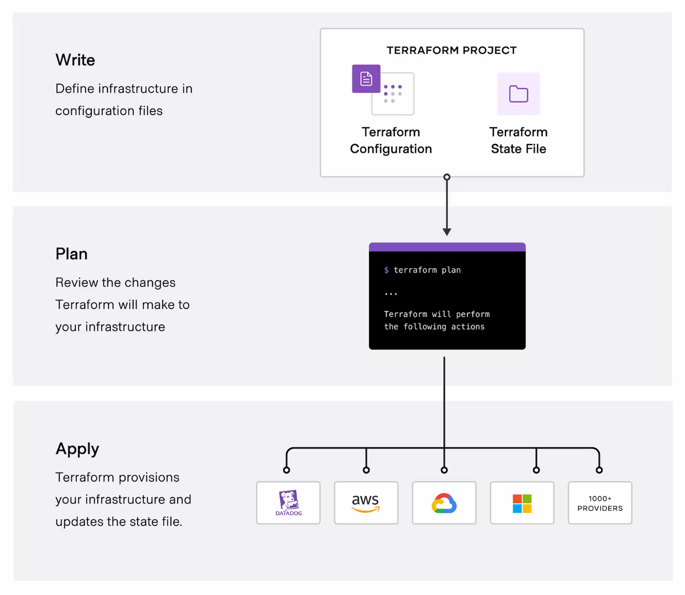
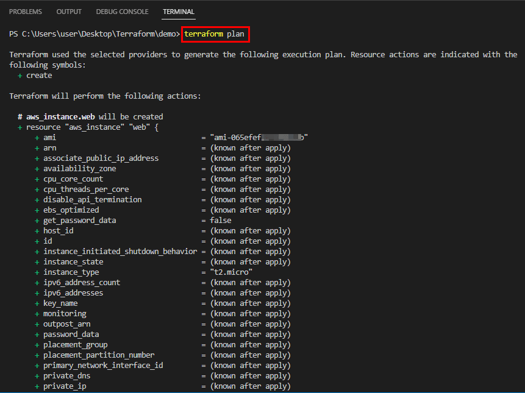

  

# Table of contents

- [*Use the core Terraform workflow*](#use-the-core-terraform-workflow)
  - [*Describe Terraform workflow ( Write -> Plan -> Create )*](#describe-terraform-workflow--write---plan---create-)
  - [*Initialize a Terraform working directory (`terraform init`)*](#initialize-a-terraform-working-directory-terraform-init)
  - [*Validate a Terraform configuration (`terraform validate`)*](#validate-a-terraform-configuration-terraform-validate)
  - [*Generate and review an execution plan for Terraform (`terraform plan`)*](#generate-and-review-an-execution-plan-for-terraform-terraform-plan)
  - [*Execute changes to infrastructure with Terraform (`terraform apply`)*](#execute-changes-to-infrastructure-with-terraform-terraform-apply)
  - [*Destroy Terraform managed infrastructure (`terraform destroy`)*](#destroy-terraform-managed-infrastructure-terraform-destroy)
  - [*Apply formatting and style adjustments to a configuration (terraform fmt)*](#apply-formatting-and-style-adjustments-to-a-configuration-terraform-fmt)
  
# *Use the core Terraform workflow*

The core Terraform workflow is a four-step process that involves writing infrastructure as code, generating an execution plan, applying the plan to provision or modify infrastructure resources, and destroying resources that are no longer needed. This workflow enables you to declaratively define your infrastructure, preview changes before applying them, manage resource lifecycles, and maintain a clean and organized infrastructure environment.

## *Describe Terraform workflow ( Write -> Plan -> Create )*

The Terraform workflow is a declarative process, meaning that you only need to define the desired state of your infrastructure, and Terraform will figure out how to get there. This makes Terraform a powerful and flexible tool for managing infrastructure as code.

### *Write*

The first stage of the Terraform workflow is to write your infrastructure as code. This is done using HashiCorp Configuration Language (HCL), a declarative language that is specifically designed for infrastructure as code. HCL is a human-readable language that is easy to learn and write.

In your HCL code, you will specify the resources that you want to manage and the attributes of each resource. For example, the resource will be a virtual machine and the attributes will be the VNet, image, region it will deploy to, etc.

### *Plan*

Once you have written your HCL code, you can use the `terraform plan` command to generate an execution plan. This plan outlines the changes that Terraform will make to your infrastructure in order to achieve the desired state.

The plan is a valuable tool for reviewing and verifying the intended changes before applying them. You can use the plan to identify any potential problems with your configuration and make sure that the changes are what you expect.

### *Create*

Once you are satisfied with the plan, you can use the `terraform apply` command to execute the planned changes. This will provision or modify your infrastructure resources to achieve the desired state.

The `terraform apply` command will make the changes to your infrastructure one resource at a time. This ensures that your infrastructure is always in a consistent state, even if there is an error during the application process.

## *Initialize a Terraform working directory (`terraform init`)*

The `terraform init` command is an essential step in preparing your infrastructure configuration environment. It performs several tasks, including locating and installing the necessary provider plugins, creating a lock file (`.terraform.lock.hcl`) to maintain plugin version consistency, and initializing the backend for storing Terraform's state. By running `terraform init`, you ensure that Terraform has the necessary components to manage your infrastructure effectively and consistently.

  

## *Validate a Terraform configuration (`terraform validate`)*

`terraform validate` ensures the integrity and correctness of your Terraform infrastructure configurations. It performs a series of checks to verify that your configuration adheres to Terraform syntax, is internally consistent, and aligns with the core principles of infrastructure as code.

  

## *Generate and review an execution plan for Terraform (`terraform plan`)*

You can generate a plan for Terraform by using the `terraform plan` command, it allows you to preview the changes that Terraform will make to your infrastructure before applying them. This helps you ensure that the changes are what you expect and that there are no unexpected consequences. Once Terraform has generated the execution plan, you should carefully review it to ensure that the changes are correct.

  

## *Execute changes to infrastructure with Terraform (`terraform apply`)*

`terraform apply` instructs Terraform to execute the changes outlined in the execution plan generated by the `terraform plan` command. This step involves applying the planned changes to your infrastructure, provisioning new resources, modifying existing ones, or destroying resources that are no longer needed.

  

## *Destroy Terraform managed infrastructure (`terraform destroy`)*

The `terraform destroy` command is used to safely and efficiently remove Terraform-managed infrastructure from your environment. It is the inverse of the `terraform apply` command and is used to bring your infrastructure back to a previous state or to completely destroy it.

  

## *Apply formatting and style adjustments to a configuration (terraform fmt)*

`terraform fmt` applies a set of formatting rules and style conventions, ensuring that your code is easy to understand and maintain. You can also specify the scope of the formatting operation using the `-dir` (Specifies the directory to scan for configuration files.), `-file` (Formats the specified configuration file.), and `-recursive` (Recursively formats all configuration files in the current directory and its subdirectories.) flags.