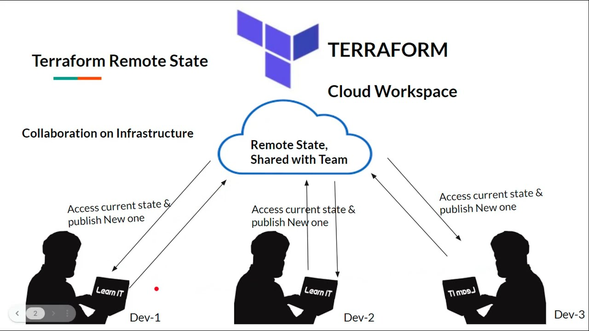
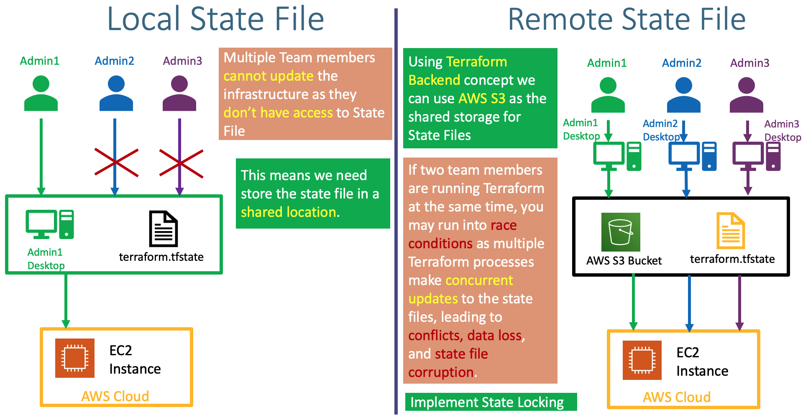

<p align="center">
  
</p>

# Table of contents

- [Implement and maintain state](#implement-and-maintain-state)
  - [*Describe default local backend*](#describe-default-local-backend)
  - [*Describe state locking*](#describe-state-locking)
  - [*Handle backend and cloud integration authentication methods*](#handle-backend-and-cloud-integration-authentication-methods)
  - [*Differentiate remote state back end options*](#differentiate-remote-state-back-end-options)
  - [*Manage resource drift and Terraform state*](#manage-resource-drift-and-terraform-state)
  - [*Describe `backend` block and cloud integration in configuration*](#describe-backend-block-and-cloud-integration-in-configuration)
  - [*Understand secret management in state files*](#understand-secret-management-in-state-files)
  
# Implement and maintain state

State is like a memory for Terraform. It helps Terraform keep track of the changes you make to your infrastructure. You can choose to store state in different places, like on your local computer or in the cloud. It's important to use Terraform commands to manage state, and not to change the state file directly. Regularly check state to make sure it's accurate. By managing state carefully, you can help Terraform manage your infrastructure effectively.

## *Describe default local backend*

The default local backend is the most basic and lightweight backend option available in Terraform. It stores Terraform's state file locally on the machine where Terraform is running. So in simple terms When you work with Terraform, it keeps track of the changes you make to your infrastructure in a file called `.tfstate`. The default local backend stores this state file on your local computer, just like a notebook.

This is a good option for small projects and learning Terraform, but it's not the best choice for larger projects or teams.

<p align="center">
  
</p>

## *Describe state locking*

State locking is like a door lock for Terraform's state file.

When multiple people are working on the same infrastructure using Terraform, there's a risk of conflicts if they try to make changes at the same time. This is where state locking comes in.

State locking works by preventing two people from making changes to the state file at the same time. This ensures that only one person can make changes at a time, and that Terraform always has an accurate view of the infrastructure.

### *How does state locking work?*

When someone runs a Terraform command that modifies the state file, Terraform first tries to acquire a lock on the state file. If the lock is available, Terraform will acquire it and make the changes to the state file. If the lock is not available, Terraform will wait until the lock is released before trying to acquire it again.

### When does Terraform lock the state file?

Terraform locks the state file whenever it runs a command that modifies the state file. For example, the following commands lock the state file:

- `terraform apply`
- `terraform destroy`
- `terraform state mv`

You can manually unlock the state file using the `terraform unlock` command.

## *Handle backend and cloud integration authentication methods*

Terraform backends provide secure access to the state file, some common methods include:

Access Keys
IAM Roles
Identity Provider Integration

Terraform interacts with various cloud providers to manage infrastructure resources. Each cloud provider has its own authentication mechanism, typically involving access keys, API tokens, or federated credentials.

## *Differentiate remote state back end options*

- Amazon S3
- Terraform Cloud
- Azure Blob Storage
- Google Cloud Storage
- HashiCorp Vault
- Consul
- Nomad

## *Manage resource drift and Terraform state*

Resource drift occurs when the actual state of your infrastructure deviates from the configuration defined in Terraform. This can lead to inconsistencies, compliance issues, security vulnerabilities, troubleshooting challenges, and unexpected costs. To prevent resource drift, implement strict change management, infrastructure automation, continuous monitoring, regular state refresh (`terraform refresh`), and Terraform drift detection. Manage Terraform state by choosing an appropriate backend, integrating it into version control, utilizing state locking, regularly refreshing, monitoring for consistency, minimizing state file edits, and using Terraform commands for state management.

## *Describe `backend` block and cloud integration in configuration*

The backend block defines the location and type of storage for Terraform's state file. The state file contains the current state of your infrastructure resources, and Terraform uses this file to track changes, plan modifications, and apply changes to your infrastructure. The choice of backend depends on your specific requirements, such as durability, scalability, and access control.

```Terraform
terraform {
  backend "remote" {
    organization = "example_corp"

    workspaces {
      name = "my-app-prod"
    }
  }
}
```

Cloud integration enables Terraform to interact with and manage resources on various cloud platforms, such as AWS, GCP, and Azure. Terraform provides providers for each cloud platform, allowing you to define and manage cloud resources using Terraform's declarative syntax. Cloud integration facilitates infrastructure automation, consistency, auditability, and security across cloud environments.

## *Understand secret management in state files*

Storing sensitive credentials directly in Terraform state files is risky due to exposure, version control integration, and accidental disclosure. Instead, use external secrets management solutions like AWS Secrets Manager, HashiCorp Vault, or Google Cloud Secret Manager to securely store and manage secrets. Reference secrets in configuration using data sources, limit access to secrets, minimize secret exposure, use Terraform interpolation, automate secret rotation, monitor secret usage, and educate developers on proper practices.