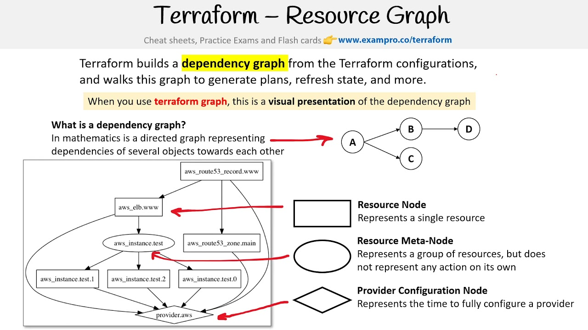

# Table of contents

- [*Read, generate, and modify configuration*](#read-generate-and-modify-configuration)
  - [*Demonstrate use of variables and outputs*](#demonstrate-use-of-variables-and-outputs)
  - [*Describe secure secret injection best practice*](#describe-secure-secret-injection-best-practice)
  - [*Understand the use of collection and structural types*](#understand-the-use-of-collection-and-structural-types)
  - [*Create and differentiate resource and data configuration*](#create-and-differentiate-resource-and-data-configuration)
  - [*Use resource addressing and resource parameters to connect resources together*](#use-resource-addressing-and-resource-parameters-to-connect-resources-together)
  - [*Use HCL and Terraform functions to write configuration*](#use-hcl-and-terraform-functions-to-write-configuration)
  - [*Describe built-in dependency management (order of execution based)*](#describe-built-in-dependency-management-order-of-execution-based)
  
# *Read, generate, and modify configuration*

The ability to read, generate, and modify configuration is crucial for effective infrastructure as code (IaC) management with Terraform. Terraform's declarative syntax allows you to define the desired state of your infrastructure, and Terraform's plan and apply commands enable you to review and implement those changes. Reading configuration provides a clear understanding of the existing infrastructure state, while generating configuration allows you to create new resources or modify existing ones in a consistent and repeatable manner. The ability to modify configuration ensures that your IaC deployments remain up-to-date and reflect the evolving needs of your infrastructure. By effectively utilizing these capabilities, you can efficiently manage your cloud infrastructure, maintain its consistency, and adapt to changing requirements.

## *Demonstrate use of variables and outputs*

Input variables allow you to parameterize your Terraform configuration, making it more reusable and adaptable. You can define variables and use them in your Terraform configuration to define values that can be changed without modifying the code itself.

For example, let's define a variable named `vpc_cidr_block`:

```Terraform
variable "vpc_cidr_block" {
  type        = string
  default     = "10.0.0.0/16"
  description = "The CIDR block for the VPC"
}
```

Within the module that declared a variable, its value can be accessed from within expressions as `var.<NAME>`

```Terraform
resource "aws_instance" "example" {
  instance_type = "t2.micro"
  ami           = var.image_id
}
```

Output variables allow you to export information from your Terraform configuration, making it available for use outside of Terraform. You can define outputs and use them to expose information about the resources you have created, such as IP addresses, domain names, or other configuration details.

For example, let's define an output named `vpc_id` that exports the ID of a VPC:

```Terraform
output "vpc_id" {
  value = aws_vpc.example.id
  description = "The ID of the VPC"
}
```

You can also use a `.tfvars` or `.tfvars.json` file to define variables.

## *Describe secure secret injection best practice*

To protect sensitive information like credentials, implement secure secret injection by using external secrets management solutions like AWS Secrets Manager or HashiCorp Vault. Reference secrets indirectly through data sources, limit access to secrets, encrypt at rest, minimize exposure in transit, rotate secrets regularly, audit usage, and educate developers.

You can read more [here](https://blog.gitguardian.com/how-to-handle-secrets-in-terraform/).

## *Understand the use of collection and structural types*

Collections represent groups of similar values, allowing you to store and manipulate multiple items of the same type. Terraform supports two primary collection types:

**Lists**: Ordered collections of values, identified by their position in the list.

**Sets**: Unordered collections of unique values, where the order of elements is not important.

Collections are versatile data structures, commonly used to represent lists of resources, parameters, or configuration options.

Structural types represent groups of potentially dissimilar values, enabling you to combine data of different types into a single structured entity. Terraform supports two primary structural types:

**Objects**: Collections of key-value pairs, where each key has a specific type and value.

**Tuples**: Ordered collections of values, where each element has a specific type.

Structural types are useful for representing complex data structures, such as nested configurations, resource dependencies, or user-defined data models.

## *Create and differentiate resource and data configuration*

Resource configurations define the infrastructure resources you want to provision, modify, or destroy. They declare the desired state of your infrastructure, instructing Terraform how to create, update, or delete resources in your cloud environment.

```Terraform
module "vpc" {
  source = "terraform-aws-modules/vpc/aws"

  name = "my-vpc"
  cidr = "10.0.0.0/16"

  azs             = ["eu-west-1a", "eu-west-1b", "eu-west-1c"]
  private_subnets = ["10.0.1.0/24", "10.0.2.0/24", "10.0.3.0/24"]
  public_subnets  = ["10.0.101.0/24", "10.0.102.0/24", "10.0.103.0/24"]

  enable_nat_gateway = true
  enable_vpn_gateway = true

  tags = {
    Terraform = "true"
    Environment = "dev"
  }
}
```

Data configurations retrieve information from external sources, such as cloud APIs, data files, or external tools. They allow you to access and utilize data from outside of Terraform to inform your infrastructure configurations.

## *Use resource addressing and resource parameters to connect resources together*

Resource addressing provides a unique identifier for each resource within a Terraform configuration. It allows you to refer to specific resources using their address, enabling connections and interactions between resources.

So for example, if you have using `count`:

```Terraform
resource "aws_instance" "web" {
  # ...
  count = 4
}
```

You can use `aws_instance.web[3]` to refer to the third virtual machine.

## *Use HCL and Terraform functions to write configuration*

HCL uses a concise and structured syntax to define infrastructure resources, their attributes, and their relationships. The basic structure of an HCL resource declaration is as follows:

```Terraform
resource "resource_type" "resource_name" {
  attribute1 = value1
  attribute2 = value2
}
```
Resource types represent the specific cloud or infrastructure components you want to manage, such as AWS EC2 instances, Azure virtual machines, or GCP Kubernetes clusters. Resource names uniquely identify each instance of a resource type within a Terraform configuration. Attributes define the characteristics and configuration of a resource.

You can also utilize Terraform functions to provide a powerful mechanism for extending HCL and enhancing the expressiveness of your configurations.

You can check them out [here](https://developer.hashicorp.com/terraform/language/functions).

## *Describe built-in dependency management (order of execution based)*

Built-in dependency management in Terraform refers to the mechanism by which Terraform automatically determines the order in which resources should be created or updated. This is crucial for ensuring that resources are provisioned in the correct sequence and that their dependencies are properly established. Terraform relies on two primary methods to manage dependencies:

**Implicit Dependencies**: Terraform infers dependencies between resources by analyzing the resource definitions and their attributes. For instance, if a resource's attribute references the ID of another resource, Terraform assumes that the first resource depends on the second and will create or update it accordingly.

**Explicit Dependencies**: In some cases, Terraform may not be able to automatically infer dependencies, especially when there are hidden relationships between resources that are not directly evident in the configuration. To address this, Terraform provides the `depends_on` meta-argument, which allows users to explicitly specify dependencies between resources.

<p align="center">
  
</p>