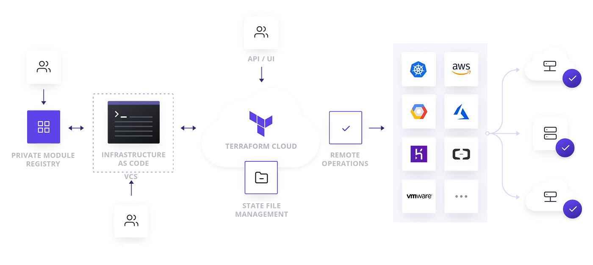

  

# *Understand Terraform Cloud capabilities*

## *Explain how Terraform Cloud helps to manage infrastructure*

Terraform Cloud streamlines infrastructure management by providing a centralized platform for infrastructure as code (IaC) operations. It offers remote execution, a private registry, policy enforcement, cost estimation, version control integration, notifications, drift detection, self-hosted agents, and enhanced collaboration and auditability. These features make Terraform Cloud a powerful tool for managing infrastructure across multiple cloud providers, ensuring consistency, security, and efficiency.

## *Describe how Terraform Cloud enables collaboration and governance*

Terraform Cloud enhances collaboration by providing a centralized platform, version control integration, access control, and notifications. It promotes governance by enforcing policies, detecting resource drift, maintaining auditability, providing cost estimation, and supporting self-hosted agents. These features enable organizations to manage infrastructure collaboratively and adhere to governance frameworks.