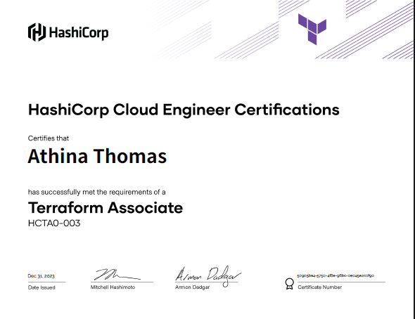

# [Terraform Beginner Bootcamp](https://app.exampro.co/student/catalog/category/hashicorp)
 
During the boot camp, I demonstrated my ability to use Gitpod, GitHub, Terraform, and AWS to develop and deploy a cloud-based application.

I used Gitpod as my development environment, documenting my progress using a GitHub markdown readme file, opening issues, and creating branches whenever I made changes to the code. I used semantic versioning and tagging with Git to keep changes to my code organized, and the vscode extension Git Graph to get a visual layout of my branches.

I learned how to save AWS and Terraform cloud credentials as environment variables. Created bash scripts that installed Terraform and AWS CLI whenever I launched a workspace in Gitpod and added commands to a YAML file to let Gitpod know what to run when starting a workspace. I learned about the Terraform module structure and how to organize services based on their purpose. For example, create a module called "networking" to contain all of the resources related to VPC, Route53, etc.

[Project Code](https://github.com/ArtistYay/terraform-beginner-bootcamp-2023) 

[Documentation](https://github.com/ArtistYay/Terraform-Bootcamp-Documentation)

Earned my HashiCorp Certified: Terraform Associate (003) certification!

